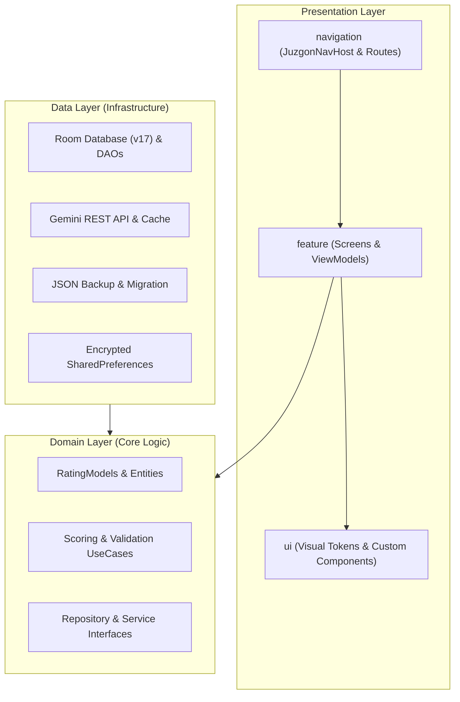
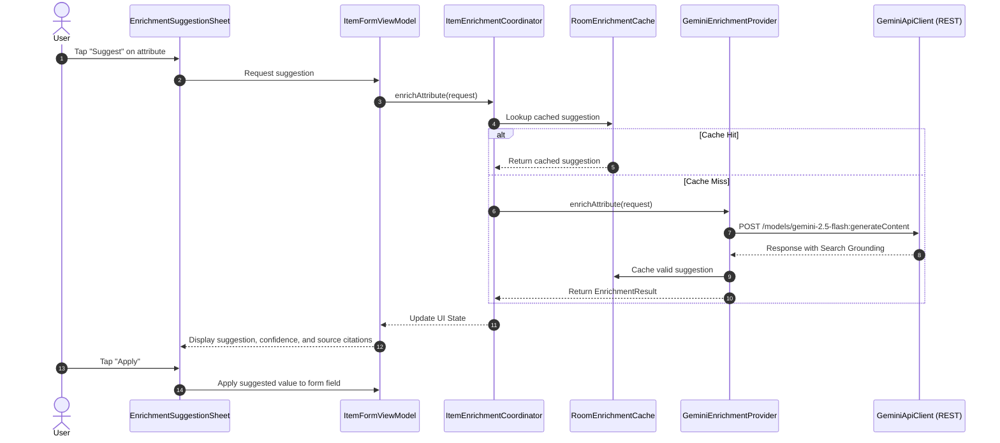

# System Architecture

## Overview

**Juzgón** is an Android application designed for creating, managing, and evaluating custom multi-attribute rating systems for any domain (e.g., athletes, films, video games, vehicles, or characters). Users can configure categories, define heterogeneous attributes, score items on a 1–10 scale, visualize rankings and multi-axis radar charts, evaluate items across different scoring lenses (profiles), and enrich item attributes using Google Gemini AI.

The codebase adheres strictly to Clean Architecture and the [Engineering Constitution](https://github.com/tlacahuepec/Constitution).

---

## Clean Architecture & Layer Boundaries

The system is organized into decoupled layers where inner layers have no knowledge of outer layers.

### Dependency Boundary Enforcement

The app strictly isolates features from data implementation details. This rule is enforced automatically on every build and CI run via a custom Gradle verification task (`:app:checkDependencyBoundaries` in [`app/build.gradle.kts`](../app/build.gradle.kts)):

1. **`feature/*` may never import `data/*`**: Feature code and ViewModels communicate exclusively through domain use cases or domain repository interfaces.
2. **`domain/*` may never import `feature/*` or `data/*`**: The business core is pure Kotlin with zero Android or framework dependencies.

---

## Domain Layer (`com.juzgon.domain`)

The domain layer encapsulates entities, value objects, domain events, and core calculation rules.

### Core Entities

- **[`Category`](../app/src/main/java/com/juzgon/domain/RatingModels.kt)**: Defines a rating subject area (e.g. "Soccer Strikers", "Sci-Fi Movies") with a collection of `Attribute`s and an optional `CatalogType`.
- **[`Attribute`](../app/src/main/java/com/juzgon/domain/RatingModels.kt)**: Represents a scoring or metadata dimension.
  - `id`: Globally scoped identifier formatted as `categoryName/attributeName`.
  - `weight`: Weight multiplier used in aggregate score calculations.
  - `type`: Data type from [`AttributeType`](../app/src/main/java/com/juzgon/domain/AttributeType.kt).
  - `displayInDiamond`: Flag indicating if this attribute is included in the radar/diamond chart.
  - `diamondOrder`: Sequence position around the radar chart axes.
  - `scoringDirection`: Valid for dates (indicates whether older or newer values receive higher scores).
- **[`RatedItem`](../app/src/main/java/com/juzgon/domain/RatingModels.kt)**: An entity being evaluated within a category, storing a list of `ScoreEntry` (scores 1–10) and `ItemAttributeValue` metadata.
- **[`ScoreProfile`](../app/src/main/java/com/juzgon/domain/ScoreProfile.kt)**: A named lens or preset within a category that selects a subset of attributes to calculate an alternative ranking (e.g., evaluating a player as a "Playmaker" vs "Finisher").

### Supported Attribute & Catalog Types

- **[`AttributeType`](../app/src/main/java/com/juzgon/domain/AttributeType.kt)**:
  - `NUMBER`: Standard numeric rating (1–10).
  - `DATE`: Dates normalized to scores via [`DateScoreCalculator`](../app/src/main/java/com/juzgon/domain/DateScoreCalculator.kt) and [`BirthDateAgeCalculator`](../app/src/main/java/com/juzgon/domain/BirthDateAgeCalculator.kt).
  - `BOOLEAN`, `DROPDOWN`, `URL`, `NOTES`: Qualitative metadata.
  - `IMAGE`: Profile avatar or picture reference.
  - `NATIONALITY`: Multi-select country dataset with ISO codes ([`NationalityDataset.kt`](../app/src/main/java/com/juzgon/domain/NationalityDataset.kt)).
  - `SOCIAL_NETWORK`: Structured platform handle/link serialization ([`SocialNetworkEntry`](../app/src/main/java/com/juzgon/domain/social/SocialNetworkEntry.kt)).
  - `SKIN_TYPE`: Skin tone / Fitzpatrick classification.
- **[`CatalogType`](../app/src/main/java/com/juzgon/domain/CatalogType.kt)**: Classification taxonomy (e.g. `PERSON`, `CHARACTER`, `MOVIE`, `TV_SHOW`, `VIDEO_GAME`, `SONG`, `ALBUM`, `SPORTS_TEAM`, `COMPANY`, `PRODUCT`, `OTHER`).

### Calculation Engines & Use Cases

- **[`CalculateWeightedAverageUseCase`](../app/src/main/java/com/juzgon/domain/usecase/CalculateWeightedAverageUseCase.kt)**: Computes the aggregate weighted score for an item:
  $$\text{Score} = \frac{\sum (\text{score}_i \times \text{weight}_i)}{\sum \text{weight}_i}$$
- **[`RankRatedItemsUseCase`](../app/src/main/java/com/juzgon/domain/usecase/RankRatedItemsUseCase.kt)**: Ranks items descending by aggregate score, with deterministic tie-breaking.
- **[`CalculateProfileRankedItemsUseCase`](../app/src/main/java/com/juzgon/domain/usecase/CalculateProfileRankedItemsUseCase.kt)**: Filters item scores down to the subset of attribute IDs included in a `ScoreProfile` and recalculates the relative ranking.

---

## Data & Persistence Layer (`com.juzgon.data`)

### Room Database (`JuzgonDatabase`)

The persistence tier is built on Android Room ([`JuzgonDatabase`](../app/src/main/java/com/juzgon/data/local/JuzgonDatabase.kt), currently schema version 17) comprising 9 entities:
1. `CategoryEntity`: Primary categories table.
2. `AttributeEntity`: Attributes scoped to categories.
3. `ItemEntity`: Rated items.
4. `RatingEntity`: Individual 1–10 score values.
5. `ItemValueEntity`: Non-numeric metadata values (dates, strings, URLs, social accounts).
6. `AttributeRankSnapshotEntity`: Historical snapshots of attribute rankings.
7. `ScoreProfileEntity`: Named scoring profiles.
8. `ScoreProfileAttributeEntity`: Join table mapping score profiles to attributes.
9. `EnrichmentSuggestionCacheEntity`: Local cache of AI-generated suggestions.

### DAO Architecture & Integrity

DAOs are segmented by single responsibility:
- Read DAOs: `CategoryDao`, `ItemDao`, `ScoreProfileDao`.
- Purge DAOs: `ItemPurgeDao` (for cascade cleanup).
- Integrity DAOs: `CategoryIntegrityDao`, `RatingIntegrityDao`, `ItemValueIntegrityDao`, `ScoreProfileIntegrityDao` used by [`DatabaseIntegrityRepository`](../app/src/main/java/com/juzgon/data/local/DatabaseIntegrityRepository.kt) and [`DatabaseMaintenanceRunner`](../app/src/main/java/com/juzgon/data/local/DatabaseMaintenanceRunner.kt) to detect and repair orphaned records without foreign key deadlocks.
- Schema Migrations: Incremental, fully tested migrations 1 ➔ 17 defined in [`DatabaseMigrations.kt`](../app/src/main/java/com/juzgon/data/local/DatabaseMigrations.kt).

### Secure Key Storage

User-provided API credentials (such as Google Gemini API keys) are secured at rest using [`EncryptedApiKeyStore`](../app/src/main/java/com/juzgon/data/security/EncryptedApiKeyStore.kt), backed by AndroidX Security Crypto's `EncryptedSharedPreferences` with AES-256 GCM encryption.

### Backup & Portability

- Schema contract: Defined in [`BackupSchemaContract.kt`](../app/src/main/java/com/juzgon/domain/backup/BackupSchemaContract.kt) (current schema v5).
- Backward compatibility: Supports importing backup formats from v1 through v5 with automatic schema migrations (e.g., normalizing bare attribute IDs to category-scoped IDs via [`BackupAttributeIdNormalizer`](../app/src/main/java/com/juzgon/data/backup/BackupAttributeIdNormalizer.kt)).
- Transactional guarantees: Export and import operations execute within atomic database transactions via [`JsonBackupService`](../app/src/main/java/com/juzgon/data/backup/JsonBackupService.kt).

---

## AI Attribute Enrichment Pipeline

Juzgón integrates Google Gemini to automatically discover, suggest, and verify attribute values (e.g. finding a player's birth date, position, or nationality).

- **Model**: `gemini-2.5-flash` with Google Search Grounding enabled.
- **Resilience**: Full error categorization ([`EnrichmentFailureCode`](../app/src/main/java/com/juzgon/domain/enrichment/EnrichmentModels.kt)) including `MISSING_API_KEY`, `RATE_LIMITED`, `NETWORK_ERROR`, and `NO_RELIABLE_SOURCE`.
- **Transparency**: Every suggestion displays source citations (URLs and titles) and confidence ratings (`HIGH`, `MEDIUM`, `LOW`).

---

## UI & Presentation Layer (`com.juzgon.ui` & `com.juzgon.feature`)

### Design System & Visual Tokens

The user interface is crafted using Jetpack Compose with Material 3 foundations augmented by custom visual tokens ([`JuzgonVisualTokens.kt`](../app/src/main/java/com/juzgon/ui/theme/JuzgonVisualTokens.kt)):
- **Palette**: Luminous dark theme (`#05040A` base background, `#100717` elevated background, `#C026D3` primary magenta glow, `#7C3AED` secondary violet glow, and `#22D3EE` contrast cyan).
- **Custom Components**:
  - [`JuzgonRadarChart`](../app/src/main/java/com/juzgon/ui/components/JuzgonRadarChart.kt): Custom Canvas-drawn diamond/radar chart displaying rankable attributes with concentric rings and score vertices.
  - [`JuzgonGlowRing`](../app/src/main/java/com/juzgon/ui/components/JuzgonGlowRing.kt): Luminous border wrapper for cards and hero imagery.
  - [`JuzgonGradientScoreBar`](../app/src/main/java/com/juzgon/ui/components/JuzgonGradientScoreBar.kt): Gradient-filled score bars with color interpolation from red (low score) to amber to vibrant purple/gold (high score).
  - [`JuzgonScorePill`](../app/src/main/java/com/juzgon/ui/components/JuzgonScorePill.kt): Compact score badges.
  - [`JuzgonHeroCard`](../app/src/main/java/com/juzgon/ui/components/JuzgonHeroCard.kt): Featured top-ranked item card with blurred backdrop and score overlays.

### Navigation Architecture

The navigation graph is centralized in [`JuzgonNavigation.kt`](../app/src/main/java/com/juzgon/navigation/JuzgonNavigation.kt):

| Route Constant | Path Pattern | Description |
|---|---|---|
| `HOME` | `home` | Discovery dashboard & category collections |
| `CREATE_CATEGORY` | `category/create` | New category definition form |
| `EDIT_CATEGORY` | `category/edit/{categoryName}` | Edit existing category & attributes |
| `CATEGORY_DETAIL` | `category/{categoryName}` | Ranked items list, filters, profile picker |
| `CREATE_ITEM` | `item/create/{categoryName}` | Create item and score attributes |
| `EDIT_ITEM` | `item/edit/{categoryName}/{itemId}` | Edit item scores and metadata |
| `ITEM_DETAIL` | `item/detail/{categoryName}/{itemId}` | Item profile, radar chart, score breakdown |
| `SCORE_PROFILES` | `score-profiles/{categoryName}` | Manage category scoring profiles |
| `SCORE_PROFILE_FORM`| `score-profile/edit/{categoryName}` | Add/edit attributes in a score profile |
| `GEMINI_KEY_SETTINGS`| `settings/gemini-key` | Manage secure Gemini API key |

---

## Verification & Engineering Practices

The repository adheres to the following testing and verification standards:
- **Unit & Robolectric Tests**: Located in [`app/src/test`](../app/src/test/java/com/juzgon), covering domain use cases, Room migrations, ViewModels, repository flow stability, and documentation consistency.
- **Architectural Verification**: Automated dependency boundary checks via `./gradlew :app:checkDependencyBoundaries`.
- **Static Analysis**: Spotless (`ktlint`) for uniform code formatting and Detekt for static analysis rules.
- **CI Pipelines**: GitHub Actions workflows ([`.github/workflows/android-ci.yml`](../.github/workflows/android-ci.yml)) running quality checks and unit tests on every pull request.
