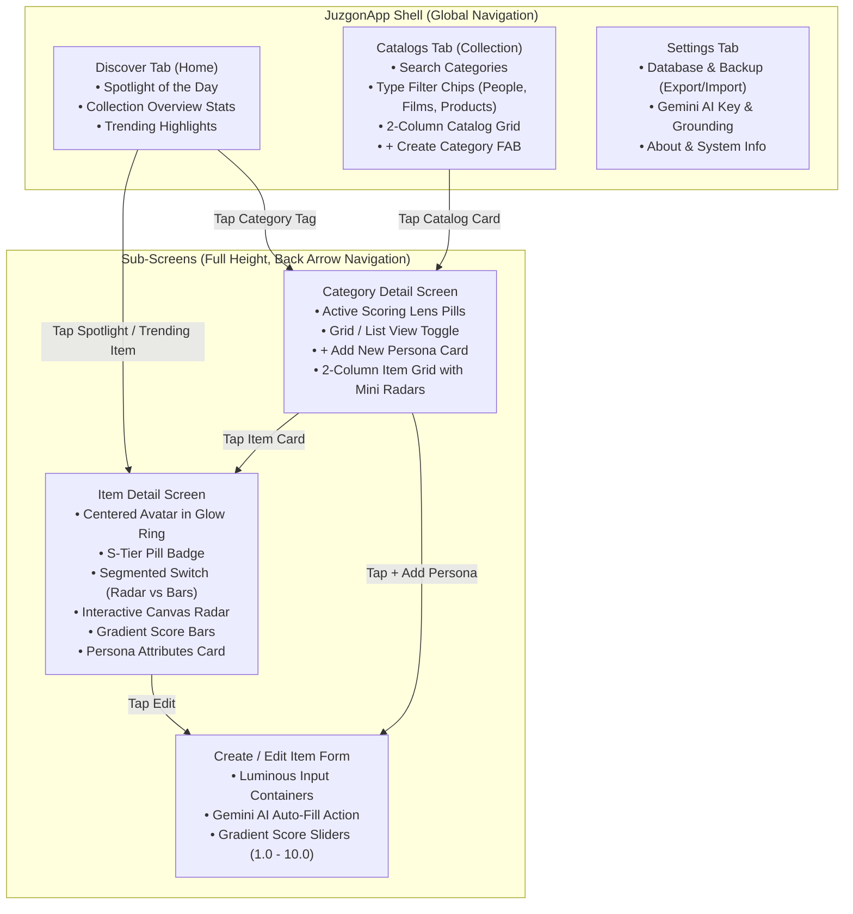

# Luminous UI Redesign & Navigation Architecture Specification

## 1. Executive Summary

This document specifies the comprehensive visual redesign and information architecture overhaul for **Juzgón**. The design preserves the application's unique luminous dark theme palette while eliminating visual clutter, resolving navigation dead-ends, fixing small-screen layout cramping, and organizing the app into intuitive, purposeful destinations.

---

## 2. Design System & Visual Tokens

The user interface adheres to custom visual design tokens defined in [`JuzgonVisualTokens.kt`](../../app/src/main/java/com/juzgon/ui/theme/JuzgonVisualTokens.kt):

| Token Name | Hex Value | Semantic Usage |
|---|---|---|
| `baseBackground` | `#05040A` | Primary pitch-black canvas background |
| `elevatedBackground` | `#100717` | Cards, bottom sheets, and elevated panels |
| `panelBackground` | `#1B0B25` | Input surfaces and tertiary containers |
| `primaryGlow` | `#C026D3` | Neon fuchsia accent borders, active glows, and badges |
| `primaryGlowStrong` | `#D946EF` | Spotlight rings, active state highlights |
| `secondaryGlow` | `#7C3AED` | Electric violet gradients and secondary buttons |
| `contrastAccent` | `#22D3EE` | Cyan focus indicators, score vertex dots, and links |
| `ratingAccent` | `#FBBF24` | Gold score badges, star icons, and rank badges |
| `textStrong` | `#FFFFFF` | Primary headers, item names, and score values |
| `textSoft` | `#F5F3FF` | Secondary body text and labels |
| `textMuted` | `#A1A1AA` | Subtitles, helper text, and metadata keys |

---

## 3. Information Architecture & Navigation



### Key Navigation Improvements:
1. **Three Distinct Top-Level Tabs**: Decoupled `Discover`, `Catalogs`, and `Settings`. Tapping each tab switches cleanly between discovery, collection management, and system preferences.
2. **Auto-Hiding Bottom Nav on Sub-Screens**: When entering `CategoryDetail` or `ItemDetail`, the bottom bar automatically tucks away to provide 100% screen real-estate for radar charts and score bars, backed by standard `←` TopAppBar navigation.
3. **Direct Item Navigation**: Tapping a Spotlight or Trending item on the Home dashboard navigates directly to `ItemDetailScreen` instead of dropping the user into the category list.

---

## 4. Visual Assets & Mockups

High-fidelity concept designs are committed to [`docs/design/prototype/`](./prototype):

1. **Home / Discover Dashboard**: [`juzgon_dashboard_redesign.jpg`](./prototype/juzgon_dashboard_redesign.jpg)  
   *Features: Minimalist header, search input, Spotlight hero card with avatar glow and mini radar, 3-stat overview, and 2-column catalog previews.*
2. **Category Detail (Driver Grid)**: [`juzgon_category_items_redesign.jpg`](./prototype/juzgon_category_items_redesign.jpg)  
   *Features: Active profile chips, 2-column cards with rank badges (#1, #2), S-Tier badges, and mini radar polygons.*
3. **Item Detail (Radar View)**: [`juzgon_item_detail_redesign.jpg`](./prototype/juzgon_item_detail_redesign.jpg)  
   *Features: Centered avatar in animated neon ring, S-Tier pill, 6-axis interactive radar polygon, and metadata card.*
4. **Item Detail (Score Bars View)**: [`juzgon_item_bars_redesign.jpg`](./prototype/juzgon_item_bars_redesign.jpg)  
   *Features: Pill-shaped progress bars with smooth purple-to-cyan gradient fills and fractional score readouts.*

---

## 5. Interactive Browser Prototype

An interactive, zero-dependency HTML5/CSS3/ES6 prototype simulating the complete app experience is located in [`docs/design/prototype/prototype.html`](./prototype/prototype.html).

### To Run:
```powershell
python -m http.server 8085 --directory docs/design/prototype
```
Open `http://localhost:8085/prototype.html` in any browser.

---

## 6. Implementation Tracking & Stories

The implementation is tracked across 8 focused GitHub issues:

| Issue | Title | Priority | Size | Status |
|---|---|---|---|---|
| [#312](https://github.com/tlacahuepec/Juzgon.com/issues/312) | `feat: Navigation Architecture Decoupling & Bottom Nav Routing` | P1 | M | Todo |
| [#313](https://github.com/tlacahuepec/Juzgon.com/issues/313) | `feat: Dedicated Settings Screen with Database Backup & Gemini Key` | P1 | M | Todo |
| [#314](https://github.com/tlacahuepec/Juzgon.com/issues/314) | `feat: Home / Discover Dashboard with Minimalist Header & Spotlight Hero` | P1 | L | Todo |
| [#315](https://github.com/tlacahuepec/Juzgon.com/issues/315) | `feat: Dedicated Catalogs Screen with Search, Type Filter Chips & Grid` | P1 | M | Todo |
| [#316](https://github.com/tlacahuepec/Juzgon.com/issues/316) | `feat: Category Detail — Add New Persona Grid Card & Luminous Polish` | P1 | M | Todo |
| [#317](https://github.com/tlacahuepec/Juzgon.com/issues/317) | `feat: Item Form — Luminous Visual Styling & Gradient Score Sliders` | P2 | M | Todo |
| [#318](https://github.com/tlacahuepec/Juzgon.com/issues/318) | `feat: Item Detail — Visual Polish, Metadata Card & Dead Code Cleanup` | P2 | S | Todo |
| [#319](https://github.com/tlacahuepec/Juzgon.com/issues/319) | `feat: Verification, Architecture Documentation & Spike #276 Closeout` | P2 | S | Todo |

---

## 7. Verification & Engineering Standards

All PRs implementing these stories must adhere to:
- **TDD (Test-Driven Development)**: RED test committed or created first, followed by GREEN implementation, followed by REFACTOR.
- **Dependency Boundaries**: Strictly enforced via `./gradlew :app:checkDependencyBoundaries`.
- **Quality Pipeline**: Full pass on `./gradlew :app:testDebugUnitTest :app:spotlessCheck :app:detekt`.
