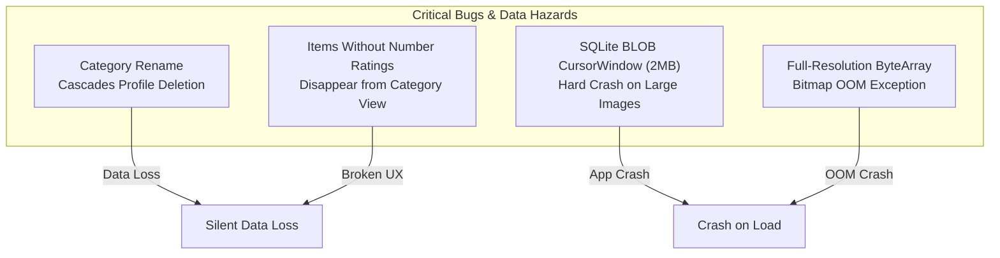
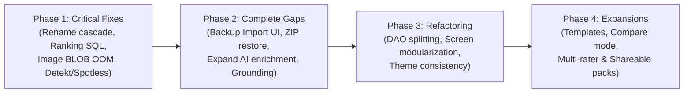

# Juzgon.com: Comprehensive System Analysis & Strategic Roadmap

## Executive Summary

**Juzgón** is an Android application designed for multi-attribute rating and evaluation systems. It combines Clean Architecture, Jetpack Compose, Material 3, Room persistence, and Google Gemini AI attribute enrichment with Google Search Grounding.

Following a thorough investigation across all layers (Domain, Data, Presentation, Navigation, Quality, and Documentation), this document provides a comprehensive audit of:
1. **Critical Bugs & Data Integrity Risks**
2. **Unfinished Work & Functional Gaps**
3. **Architecture & Technical Debt**
4. **UI, Accessibility & Theme Inconsistencies**
5. **Areas of Improvement & High-Value Expansion Roadmap**

---

## 1. Critical Bugs & High-Severity Problems



### 1.1 Category Rename Causes Silent Deletion of All Score Profiles (Data Loss)
- **Location**: [`RoomRatingRepositories.kt`](file:///C:/Users/santi/Repos/Juzgon.com/app/src/main/java/com/juzgon/data/repository/RoomRatingRepositories.kt#L126-L145), [`ScoreProfileEntities.kt`](file:///C:/Users/santi/Repos/Juzgon.com/app/src/main/java/com/juzgon/data/local/entity/ScoreProfileEntities.kt#L10-L18)
- **Root Cause**: In `RoomCategoryRepository.renameCategory()`, the new category and new attributes are created, attribute IDs are renamed in ratings/values, and then `categoryDao.deleteCategoryByName(originalName)` is called. Because `ScoreProfileEntity` defines a foreign key `ForeignKey(entity = CategoryEntity::class, parentColumns = ["name"], childColumns = ["category_name"], onDelete = ForeignKey.CASCADE)`, deleting `originalName` triggers SQLite foreign-key cascade deletion of all score profiles belonging to that category!
- **Impact**: Renaming a category permanently wipes out all customized score profiles and their attribute associations without warning.

### 1.2 Items Without Numeric Ratings Disappear from Category Rankings
- **Location**: [`RatingDaos.kt`](file:///C:/Users/santi/Repos/Juzgon.com/app/src/main/java/com/juzgon/data/local/dao/RatingDaos.kt#L188-L208)
- **Root Cause**: `ItemDao.observeRankedItemsForCategory()` executes:
  ```sql
  FROM items
  INNER JOIN ratings ON ratings.item_id = items.id
  INNER JOIN attributes ON attributes.id = ratings.attribute_id
  WHERE attributes.category_name = :categoryName AND attributes.type = 'NUMBER'
  GROUP BY items.id
  ```
  If a category has only date/qualitative attributes, or if an item is created where numeric ratings are optional and left unrated, the `INNER JOIN ratings` and `WHERE attributes.type = 'NUMBER'` causes the query to return zero rows.
- **Impact**: Items saved by the user vanish from the Category Detail screen. Furthermore, date scores computed by `DateScoreCalculator` in `RoomRatedItemRepository` never execute because the item was already omitted by the SQLite query.

### 1.3 SQLite CursorWindow 2MB Limit Crash on `item_images` BLOBs
- **Location**: [`DatabaseMigrations.kt`](file:///C:/Users/santi/Repos/Juzgon.com/app/src/main/java/com/juzgon/data/local/DatabaseMigrations.kt#L344-L356), [`RatingEntities.kt`](file:///C:/Users/santi/Repos/Juzgon.com/app/src/main/java/com/juzgon/data/local/entity/RatingEntities.kt#L119-L154)
- **Root Cause**: In migration 18->19, `item_images` stores `bytes BLOB NOT NULL`. When users attach photos directly from mobile cameras (typically 5–15 MB per picture), saving raw bytes into Room tables will cause Android's SQLite cursor window (hard limited to 2MB or 4MB) to fail during read queries with `android.database.sqlite.SQLiteBlobTooBigException`.
- **Impact**: Any item detail view or item list query that loads `ItemWithRatings` will crash fatal on startup once a large photo is attached.
- **Remedy**: Store image files on internal storage (`context.filesDir/images/...`) and persist only relative file paths/URIs in SQLite.

### 1.4 Unsampled Full-Resolution Bitmap Decoding in Compose
- **Location**: [`ItemDetailScreen.kt`](file:///C:/Users/santi/Repos/Juzgon.com/app/src/main/java/com/juzgon/feature/item/ItemDetailScreen.kt#L1126-L1128), [`ItemFormScreen.kt`](file:///C:/Users/santi/Repos/Juzgon.com/app/src/main/java/com/juzgon/feature/item/ItemFormScreen.kt#L1074-L1077)
- **Root Cause**: In `imageBitmapFromValue()`:
  ```kotlin
  if (bytes != null) {
      return@runCatching BitmapFactory.decodeByteArray(bytes, 0, bytes.size)
  }
  ```
  While URI loading uses `sampleSizeFor(maxDimensionPx)` to downscale large images to ~512px, byte arrays completely bypass sample size calculation and decode at 100% resolution in RAM (e.g. 12MP = ~48MB uncompressed bitmap in heap).
- **Impact**: Rapid memory consumption and `OutOfMemoryError` crashes when browsing or editing items with photos.

### 1.5 Detekt and Spotless Verification Failures
- **Location**: Working tree on `feature/issue-243-backup-coverage`
- **Violations**:
  - `JsonBackupService.kt`: `ComplexCondition` (line 160), `ThrowsCount` (line 150), `MaxLineLength` (line 81).
  - `ItemFormModels.kt`: `LongMethod` in `toRatedItem()` (line 106).
  - `ItemFormViewModel.kt`: `LongMethod` in `loadExistingItem()` (line 91).
  - `Spotless`: Format violations across 18 files.

---

## 2. Unfinished Work & Feature Gaps

| Feature Area | Current State | Missing Gap |
|---|---|---|
| **Backup & Restore UI** | `SettingsScreen` has only "Export backup". | **No "Import backup" UI** exists anywhere. Users have no way to restore a backup file. |
| **ZIP Archive Import** | `BackupService.exportArchive()` creates `.juzgon.zip`. | `BackupService.importArchive()` throws `BackupException("Image archive import is unavailable")`. `JsonBackupRestorer` has no image restore logic. |
| **AI Attribute Enrichment** | `EnrichmentSupportRules.isSupported` strictly permits only `DATE` attributes with display name `"birthdate"` or `"birth date"`. | Cannot suggest positions, nationalities, movie release dates, car specs, or skin types, despite docs claiming multi-attribute support. |
| **Grounding Citations** | `GeminiApiClient.extractGroundingMetadata()` parses Google Search Grounding. | Never called in production; `generateContent()` drops the raw JSON response and returns only plain text. |
| **Attribute Labels in Form** | Form uses `attribute.id` (e.g. `Players/Birth Date`). | Form displays full internal compound key instead of `attribute.displayName` in boolean, nationality, and text inputs. |
| **Orphaned Feature Package** | `com.juzgon.feature.about` contains `AboutDialog.kt` and `AboutViewModel.kt`. | Never displayed or routed anywhere in the app; `SettingsScreen` implements its own `AboutSection`. |
| **Cache Management** | `EnrichmentSuggestionCacheDao` has `clear()`. | No UI in Settings to inspect cache size or clear AI suggestion cache. |

---

## 3. Architectural & Technical Debt Analysis

### 3.1 Room Database & Migration Strategy
- **Documentation Drift**: `docs/architecture.md` states Room is at version 17, but the codebase has v18 (suggested dropdown values) and v19 (item images).
- **Unindexed & Unchecked Image Foreign Keys**: `item_images.attribute_id` does not have a foreign key constraint or cascade delete. Deleting an attribute leaves orphaned image records. `DatabaseIntegrityRepository` and `DatabaseMaintenanceRunner` do not audit `item_images`.
- **Monolithic DAOs**: `RatingDaos.kt` contains 4 DTO models and 4 DAO interfaces in a single 287-line file with `@file:Suppress("TooManyFunctions")`. It should be split into focused interfaces (`CategoryDao`, `ItemDao`, `DaoModels.kt`) as outlined in [`docs/fixesAfterRefactor.md`](file:///C:/Users/santi/Repos/Juzgon.com/docs/fixesAfterRefactor.md).

### 3.2 View & Screen Monoliths
- `CategoryDetailScreen.kt`: 1564 lines
- `ItemDetailScreen.kt`: 1219 lines
- `ItemFormScreen.kt`: 1106 lines
- These files mix UI presentation, state reducers, canvas chart calculations, image decoders, and accessibility formatting. Extracting subcomponents into dedicated modules will improve testability and compile times.

### 3.3 Theme Inconsistency with System Light Mode
- In [`MainActivity.kt`](file:///C:/Users/santi/Repos/Juzgon.com/app/src/main/java/com/juzgon/MainActivity.kt#L18-L22), `JuzgonTheme` defaults to system theme (`isSystemInDarkTheme()`).
- In [`JuzgonTheme.kt`](file:///C:/Users/santi/Repos/Juzgon.com/app/src/main/java/com/juzgon/ui/theme/JuzgonTheme.kt#L18-L38), `JuzgonLightColorScheme` uses white backgrounds (`#FFFFFBFE`), while `JuzgonVisualTokens` always uses `#05040A` pitch-black tokens.
- **Result**: On devices with system light mode enabled, screens render mismatched white and pitch-black surfaces with unreadable text contrast.

---

## 4. Prioritized Remediation & Execution Plan



### Phase 1: Critical Fixes (Immediate)
1. **Fix Category Rename Score Profile Deletion**:
   - In `RoomRatingRepositories.renameCategory()`, re-point `score_profiles.category_name` to the new category name *before* deleting the old category:
     `UPDATE score_profiles SET category_name = :newCategoryName WHERE category_name = :oldCategoryName`.
2. **Fix Item Ranking Query**:
   - Update `ItemDao.observeRankedItemsForCategory()` to use `LEFT JOIN ratings` and include items whose attributes are in the category, ensuring unrated or date-only items appear in the rankings.
3. **Refactor Image Storage from Room BLOB to Files**:
   - Store image files in `context.filesDir/images/` and store local file URIs/paths in SQLite to eliminate the 2MB CursorWindow limit.
   - Implement `BitmapFactory.Options.sampleSizeFor()` in `decodeByteArray` to prevent OOM.
4. **Resolve Detekt & Spotless Failures**:
   - Break up long methods (`toRatedItem`, `loadExistingItem`), split condition checks, and run `./gradlew :app:spotlessApply`.

### Phase 2: Feature Completion & Core Polish
1. **Backup Import & ZIP Restoration**:
   - Add "Import Backup" SAF document picker button in `SettingsScreen`.
   - Implement `BackupService.importArchive(archive: ByteArray)` to extract `data.json`, validate images from `images/`, and restore both DB and image files.
2. **Expand Gemini AI Enrichment**:
   - Extend `EnrichmentSupportRules.isSupported()` to allow enrichment for `DROPDOWN` (positions, roles), `NATIONALITY`, `SKIN_TYPE`, and general `DATE` attributes.
   - Connect `GeminiApiClient.extractGroundingMetadata()` so Google Search Grounding sources and URLs are displayed in `EnrichmentSuggestionSheet`.
3. **Display Name Consistency in Form Fields**:
   - Replace `attribute.id` with `attribute.displayName` in `ItemFormScreen` inputs.
4. **Remove Dead Code or Integrate About Dialog**:
   - Either hook `AboutDialog` from `SettingsScreen` or prune `com.juzgon.feature.about`.
5. **Theme Hardening**:
   - Force pitch-black luminous theme by default or offer an explicit user-selected Dark/Luminous toggle in Settings.

### Phase 3: Architectural Cleanup
1. **DAO Restructuring**:
   - Separate `CategoryDao`, `ItemDao`, and move relation models (`ItemWithRatings`, `CategoryWithAttributes`, etc.) to `DaoModels.kt`.
2. **Decompose Screen Monoliths**:
   - Extract `ProfileHero`, `RankedAttributeList`, and `ImageAttributePreview` into dedicated composable files.
3. **Image Integrity Maintenance**:
   - Add foreign key / maintenance purge queries for orphaned images in `DatabaseMaintenanceRunner`.

---

## 5. Potential Expansion Capabilities (Roadmap)

### 5.1 Category Starter Templates
- Pre-packaged templates with calibrated attribute weights:
  - **Sports**: Football Striker, Goalkeeper, Basketball Point Guard.
  - **Media**: Feature Film, Video Game, Music Album, TV Series.
  - **Lifestyle**: Specialty Coffee, Cars, Board Games, Restaurants.

### 5.2 Head-to-Head Item Comparison Mode
- Select two items within a category to render overlapping multi-axis radar charts:
  - Highlight strengths and weaknesses with comparative delta pills (`+1.4 pace`, `-0.8 finishing`).

### 5.3 Profile-Specific Attribute Weighting
- Allow `ScoreProfile` to not only toggle attributes on/off, but also define custom weight overrides (e.g. giving "Speed" weight 3.0 in "Counter-Attacker" profile vs 1.0 in "Possession" profile).

### 5.4 Exportable Card Infographics
- Render a shareable high-resolution card (JPEG/PNG) of an item with its radar chart, rank pill, and primary attributes for sharing on social networks.

### 5.5 Multi-Rater / Collaborative Scoring
- Support multiple scoring passes (e.g. Rater 1 vs Rater 2) and compute consensus averages, variance, and disagreement highlights.
